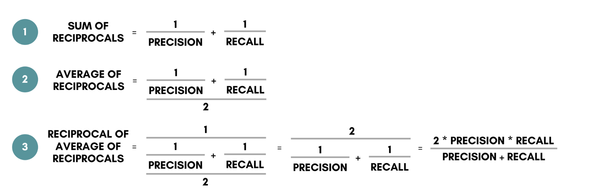

```{r setup, include=FALSE}
knitr::opts_chunk$set(echo = TRUE)
library(dplyr)
library(ggplot2)
library(plyr)
library(mlbench)
library(GGally)
library(caret)
set.seed(03092000)
```

# Research Question and Hypotheses  
**Goal**: Through this project, our group hopes to utilize both the **Support Vector Machine** (SVM) and **Random Forest Classifier** models to predict whether a person is or is not going to get the H1N1 vaccine. These two algorithms were selected for the reasons that are provided below in the "Why Support Vector Machine and Random Forest Classifier" section. 

We will first begin by explaining some background information on the H1N1 virus, the dataset, and the two machine learning algorithms. From there, we will proceed with the model creation and the parameter tuning. Lastly, we will draw conclusions from our findings and discuss future applications. 

**General Question**: Will the SVM or the Random Forest Model Predict the Likelihood of a Person Getting the H1N1 Vaccine Better?

**Null Hypothesis**: The SVM Polynomial Kernel will not outperform the Random Forest Classifier Model with regards to its F1 Score 
**Alternative Hypothesis**: The SVM Polynomial Kernel will outperform the Random Forest Classifier Model with regards to its F1 Score

**Note**: The F1 score was the metric used to primarily evaluate the two models. To determine if the F1 scores are statistically significant, a **t-test** will be utilized. More information about this can be found in the "Why F1 Score" section below.

# Why a Focus on F1 Score  


Throughout our project, we will be looking at multiple metrics to evaluate the performance of the SVM and Random Forest models. These include accuracy, precision (specificity), and recall (sensitivity). While all of these metrics will play a role in how we tune the models' parameter and determine which model is more successful, to answer our question of which model outperforms the other we will be looking at the F1 value. 

The F1 value is the harmonic mean of the sensitivity and specificity rates, and it gives a better measure of the incorrectly classified cases than the accuracy metric would. It is scaled from 0 to 1, with 1 being the best. Because there is an imbalanced class distribution in our dataset, we will be analyzing the F1 score as it is a better indicator of which model is performing better. After getting the F1 scores for both the SVM and the Random Forest models, we will be utilizing a t-test to determine if the difference between the F1 scores of the models is due to chance or is statistically significant. This will determine whether a model outperforms the other.

An explanation of why the SVM and Random Forest models were specifically selected for this project will be explained later after some data cleaning. 

# Background on H1N1. 
The flu is an illness that is caused by the influenza virus, which can lead to various symptoms that include, but are not limited to, high fevers and sore throats. The Swine Flu, in particular, is a novel influenza A (H1N1) virus that emerged in Spring 2009. It is a subtype of the Influenza A Virus and is considered an **orthomyxovirus** that contains the glycoproteins **haemagglutinin** and **neuraminidase**. The Swine Flu was initially detected in the United States, eventually spreading to the rest of the world. It is said to have "contained a blend of flu genes that hadn't been previously seen in animals or people." The Swine Flu, although very similar to the Seasonal Flu, was found to be more contagious, and less people were found to have existing resistance. (Reference 2)


# About the Dataset  
The selected dataset for this project is originally from the National 2009 H1N1 Flu Survey but can also be found on [Driven Data](https://www.drivendata.org/competitions/66/flu-shot-learning/page/210/). 

Before building our machine learning algorithms, having a clear understanding of the data is critical. We must familiarize ourselves with the origin, size, key characteristics, behavior, and type of data. Our dataset is originally composed of **38 columns** and **26,707 observations**. Each observation accounts for one person who responded to the National 2009 H1N1 Flu Survey. There are five general groupings that each feature falls into. These data categories can be found below with a few examples of the types of variables that would belong to it: 

1. Presumptions
- h1n1_concern, h1n1_knowledge
2. Behavioral: public health measure and avoidance strategies
- behavioral_face_mask, behavioral_large_gatherings, behavioral_touch_face
3. Opinion: respondent’s opinion regarding the vaccine
- opinion_h1n1_risk, opinion_h1n1_sick_from_vacc
4. Demographics
- age_group, income_poverty, education, hhs_geo_region
5. Health Considerations: doctor recommendations, conditions
- doctor_recc_h1n1, chronic_med_condition, health_insurance

According to the CDC, initially there were **734,367 landline numbers** that were considered. After being narrowed down due to the unresponsiveness or the age of the respondent, a total of **105,499** respondents that were adults were found eligible. However, only **43.2%** of these individuals completed the interview. It is fair to assume that there is a **non-response bias** in play with the survey. This is important to keep in mind as it can be a source of explanation as to why the data may be imbalanced. It is very likely that individuals who were pro-vaccination were more likely to want to answer the National 2009 H1N1 Flu Survey, therefore, skewing the results. (Reference 1)

With responses from both the **adults and the children**, the CDC states that there are a total of **56,656** people who responded to the National 2009 H1N1 Flu Survey; these were composed of both landline and cellphone interviews. In our dataset, because we only have data for **26,707** respondents, it is safe to assume that the dataset is a sample of the original National 2009 H1N1 Flu Survey. (Reference 1)

Before getting into the details of why the SVM and Random Forest models were selected, we must clean the data and get a better understanding of it.

# Data Cleaning {.tabset}

## Reading in the Dataset
```{r, include=FALSE}
df_features <- read.csv("training_set_features.csv")
df_label <- read.csv("training_set_labels.csv")
df <- merge(df_features,df_label,by="respondent_id")
#head(df)
#sum(nrow(df))
```
The original dataset was provided in two csv files. To begin our analysis, we must first combine the two into one dataframe. This is because one csv file has the features we are interested in while the other has the labels for our observations (whether the individual received the H1N1 and Seasonal Flu Vaccine or not). We matched up each of the rows by the respondent_id, which was a column in both the features and the label csv files. 

## Removing the Seasonal Flu Columns
```{r}
df <- df[, -which(names(df) %in% c("doctor_recc_seasonal","opinion_seas_vacc_effective","opinion_seas_risk","opinion_seas_sick_from_vacc", "seasonal_vaccine"))]
head(df)
```
Given the recent COVID-19 pandemic, our group chose to focus only on the vaccination for H1N1, which is also known as the Swine Flu. We believe that our findings will be interesting in regards to comparing it to COVID-19. Therefore, we removed the five columns that only dealt with the Seasonal Flu.  

H1N1 was still seen as a “new virus”, although it was a different strain of the seasonal flu. Similarly, the COVID-19 virus and pandemic is also new and relatively unknown. We should be able to draw some similarities between skepticism and opinions regarding vaccinations between the two viruses.

## Looking at the Structure of the Data: Type and NA's
```{r}
str(df)
```
Looking at the structure of the dataset, we notice a few things. Initially, we notice that there are a few empty strings in some of the variables, for example employment_occupation and empoloyment_industry, that we want to convert to NA's. This will make it easier for us when we are analyzing the number of missing datapoints we have in order to figure out what variables we may want to consider dropping. Additionally, all of these variables must be converted to factors. This is because of the nature of the survey and types of variables we have present. 

We notice that for certain variables, specifically hhs_geo_region, employment_industry, and employment_occupation, these use a classification defined by the U.S. Dept. of Health and Human Services. Because these variables are encoded for confidentiality  purposes, and the encoding is not provided online, we are unable to make use these variables. Therefore, these columns will be dropped from the dataset.

## Changing the Empty Strings
```{r}
df <- replace(df, df == "", NA)
```
Here, we replaced all rows with empty strings to contain the value "NA" instead. This will come in handy as we proceed with the analysis.

## Looking at Na's and Removing Specific Columns
```{r}
colSums(is.na(df))
```
Looking at the number of NA's we have present in each column, we can see that the health_insurance, employment_industry, and employment_occupation make up the top 3 columns with the highest amount of NA's.

We decided to remove the health_insurance column for a few reasons. It was the main source of NA's within the dataset (12,274), and deleting rows associated with this column would have effectively eliminated nearly half of the dataset. In addition, we did some further research into the financial obligations regarding the H1N1 vaccine. According to the Centers for Disease Control (CDC), the government wanted to avoid any economic obstacles for everyday Americans when it came to obtaining a vaccine. Vaccination providers, such as clinics or drugstores, were not allowed to charge volunteers for the vaccine, as the supplies had already been purchased by the US Government. This allowed us to conclude that health insurance, therefore, would not be as necessary or as big of an obstacle for obtaining the H1N1 vaccine, in comparison to others. Further information can be found [here](https://www.cdc.gov/h1n1flu/vaccination/statelocal/vaccine_financing.htm).

We also chose to remove the employment_industry and employment_occupation variables. Similarly to health_insurance, removing observations with “NA” for these two variables would have resulted in nearly half of our dataset being eliminated. These variables include “codes” that are correlated to US Census data regarding industry and occupation types. Converting these to factor variables and then taking the average or median to engineer data for the NA's would be inaccurate. We would be left with very high numbers of one particular industry and occupation, which would not help the model in determining if people would get an H1N1 vaccine or not.

Lastly, we removed the respondent_id at this step. This variable was important when we were matching the features to the labels. However, for the machine learning algorithm, it is not needed.

```{r}
df <- df[, -which(names(df) %in% c("employment_occupation","health_insurance","employment_industry", "hhs_geo_region", "respondent_id"))]
df<- na.omit(df)
#write.csv(df,"df2.csv", row.names = TRUE) #saving to a new csv file
df2<- read.csv("df2.csv")
nrow(df)
```
Here, along with removing the top 3 columns with the highest number of NA's, we also removed the hhs_geo_region variable for reasons mentioned above. We are left with 19,656 observations. Because this is still a significant portion of the original number of observations the dataset had (approximately 73.6%), we proceed with our analysis.

## Coercing the Variables to Factors
```{r}
df[,] <- lapply(df[,], factor)  ## as.factor() could also be used
str(df)
#write.csv(df,"cleaned_df.csv", row.names = TRUE) #saving to a new csv file
```
After this step, we can verify that all of the variables are now factors by using the str() function. Because they are all factors, we can carry on with our analysis.

# Why Support Vector Machine and Random Forest Classifier  
```{r, message = FALSE, warnings = FALSE}
library(dplyr)
library(tidyverse)
pie( c( nrow(df %>% filter(h1n1_vaccine==0)), nrow(df %>% filter(h1n1_vaccine==1))), labels = c("Not Vaccinated, 77%", "Got Vaccinated, 23%"),border = "white", col= c("#015977", "#606DA2"), main = "Base Rate of H1N1 Vaccinations" )
```

After a preliminary analysis of the data topology, our group decided to compare the SVM and Random Forest models. We were curious to how these two models would perform against one another due to the nature of the algorithms. Both are **supervised machine learning algorithms** which can be used for **classification** or **regression** analysis. For the purposes of our analysis, we will be using these algorithms to classify which group a person, given various features, is likely to belong to (vaccine/no vaccine). We selected these algorithms because they are both great for imbalanced datasets, which as we can see above, our dataset has a base rate of 23% for the group who received the vaccine; because our dataset is imbalanced, it is critical to utilize algorithms that can deal with it fairly well. Similarly, both of the algorithms reduce the risk of over-fitting in their own manner. This is also extremely important for our model as overfitting to the dataset can falsely skew the accuracy of the model.

In theory, the Random Forest model would have a few benefits over the SVM model. The Random Forest is non-parametric, so outliers would not be an issue for the algorithm. Similarly, they are extremely easy to build (compared to SVMs) and are fast/scalable. Unlike with SVMs, Random Forests do not require a lot of parameter tuning. These are all characteristics of the algorithm that make it extremely favorable for this research study.

However, the SVM model also has a few general benefits over the Random Forest model. Usually, the SVM model is known to be highly efficient and accurate. Similarly, the SVM model scales well to high dimensional data, which is not significantly relevant for our dataset as we have more observations than we do features. However, the main reason why we predict that the SVM model will outperform the Random Forest model is because of the kernels that the SVM model uses. With an appropriate kernel and degree of the kernel, we can expect the algorithm to work extremely well even if the data is not linearly separable in the base feature space, which in this instance applies to our dataset.

In order to begin building our model, we now proceed to the feature selection, followed by the EDA. These are two sections that will help us gain a better understanding of the dataset and re-adjust our hypotheses, if needed. 

# Feature Selection {.tabset}

## Corellogram 
```{r, message = FALSE, warnings = FALSE, fig.show='hide'}
df2<- read.csv("cleaned_df.csv")
h1n1_correlation = ggcorr(df2, method = c("everything", "pearson"), title = "H1N1 Factors Correlogram")
h1n1_correlation
```
A correlogram was utilized to inform and guide future efforts for feature selection. We aimed to identify variables weakly correlated to the target variable and then test model performance with & without those variables. As demonstrated above, none of the variables are particularly strongly correlated with whether someone relieved the h1n1 vaccination. However, the most correlated are doctor recommendation, opinion about the risk of getting sick with the flu vaccine, and their opinion of whether or not the h1n1 vaccine was effective with correlations of 0.13, 0.11, and 0.09 respectively.

# EDA {.tabset}

## Histogram for "Presumptions" Variables
```{r}
pre_1 <- ggplot(df2, aes(x=h1n1_concern)) +
  geom_histogram(stat="count",bins=4,fill="#015977",color="black")+xlab("Level of H1N1 Concern") + geom_text(aes( label = scales::percent(..prop..),y= ..prop.. ), stat= "count", vjust = -.5)
pre_1
```

Over 70 percent of respondents presented a moderate level of concern regarding H1N1. 11.5% and 16.2% indicated "not at all concerned" and "very concerned", respectively. We would expect those that indicated "very concerned" to be the most likely to get the H1N1 vaccine.
0-Not at all concerned
1-Not very concerned
2-Somewhat concerned
3-Very concerned

```{r}
pre_2 <- ggplot(df2, aes(x=h1n1_knowledge)) + 
  geom_histogram(stat="count",bins=3,fill="#015977",color="black")+xlab("Level of H1N1 Knowledge") + geom_text(aes( label = scales::percent(..prop..),y= ..prop.. ), stat= "count", vjust = -.5)
pre_2
```

The histogram shows there to be a suprisingly large proportion of respondents that indicated "A lot of knowledge" of the H1N1 Virus, with 37%. Only 7% indicated "No knowledge". We would expect the majority of those that reported having "A lot of knowledge" to want the vaccine, when compared to those reporting "No knowledge".
0-No knowledge
1-A little knowledge
2-A lot of knowledge

## Histogram for "Behavioral" Variables
```{r}
beh1 <- ggplot(df2, aes(x=behavioral_wash_hands)) + 
  geom_histogram(stat="count",bins=2,fill="#35648F",color="black")+xlab("Frequent Hand Washing / Hand Sanitizer Use") + geom_text(aes( label = scales::percent(..prop..),y= ..prop.. ), stat= "count", vjust = -.5)
beh1
```

17% of respondents indicated infrequent hand washing and lack of sanitizer use, while 83% indicated the opposite. We would expect those that reported frequent usage to be more likely to get the H1N1 vaccine, as this indicates more self-awareness of healthy habits and the presence of germs.
0-No
1-Yes

```{r}
beh2 <- ggplot(df2, aes(x=behavioral_large_gatherings)) + 
  geom_histogram(stat="count",bins=2,fill="#35648F",color="black")+xlab("Avoidance of Large Gatherings") + geom_text(aes( label = scales::percent(..prop..),y= ..prop.. ), stat= "count", vjust = -.5)
beh2
```

65% of respondents indicated NOT avoiding large gatherings during the H1N1 crisis, while 35% indicated the opposite. We would expect those that indicated that they practiced avoidance measures to be more likely to get the H1N1 vaccine, as they would seem to be more worried of the risks of the virus.
0-No
1-Yes

## Histogram for "Opinion" Variables
```{r}
opi1 <- ggplot(df2, aes(x=opinion_h1n1_risk)) + 
  geom_histogram(stat="count",bins=5,fill="#606DA2",color="black")+xlab("Opinion of H1N1 Risk") + geom_text(aes( label = scales::percent(..prop..),y= ..prop.. ), stat= "count", vjust = -.5)
opi1
```

There is a relatively large disparity between opinions regarding H1N1 risk. Nearly 70% of respondents indicated the risk to be "Very Low" or "Somewhat Low", while only 28.2% indicated the risk posed by H1N1 to be "Somewhat High" or "Very High".
1-Very Low
2-Somewhat Low
3-Don't Know
4-Somewhat High
5-Very High

```{r}
opi2 <- ggplot(df2, aes(x=opinion_h1n1_sick_from_vacc)) + 
  geom_histogram(stat="count",bins=5,fill="#606DA2",color="black")+xlab("Opinion of Sickness from H1N1 Vaccine") + geom_text(aes( label = scales::percent(..prop..),y= ..prop.. ), stat= "count", vjust = -.5)
opi2
```

There is a relatively large disparity between opinions regarding getting sick from the H1N1 vaccince. 69.5% of respondents indicated the risk of sickness to be "Not at all worried" or "Somewhat Worried", while only 30.2% indicated the risk of sickness to be "Somewhat Worried" or "Very Worried".
1-Not at all worried
2-Not very worried
3-Don't know
4-Somewhat worried
5-Very worried

## Histogram for "Demographics" Variables
```{r}
dem1 <- ggplot(df2, aes(x=age_group)) + 
  geom_histogram(stat="count",fill="#8C74AE",color="black")+xlab("Age Group")
dem1
```

The 65+ age group was the most represented among respondents, while the 35-44 was the least represented.


```{r}
dem2 <- ggplot(df2, aes(x=education)) + 
  geom_histogram(stat="count",fill="#8C74AE",color="black")+xlab("Level of Education")
dem2
```
The majority of respondents indicated having at least some college. The most represented group were College Graduates.


```{r}
dem3 <- ggplot(df2, aes(x=employment_status)) + 
  geom_histogram(stat="count",fill="#8C74AE",color="black")+xlab("Employment Status")
dem3
```
Over 50% of respondents indicated that they were employed.


## Histogram for "Health Considerations" Variables
```{r}
hc1 <- ggplot(df2, aes(x=doctor_recc_h1n1)) + 
  geom_histogram(stat="count",bins=2,fill="#B77AB0",color="black")+xlab("Doctor Recommendation of H1N1 Vaccine") + geom_text(aes( label = scales::percent(..prop..),y= ..prop.. ), stat= "count", vjust = -.5)
hc1
```
77% of respondents indicated that their doctor did NOT recommend getting the H1N1 Vaccine, while only 23% indicated the presence of a recommendation.
0-No
1-Yes

```{r}
hc2 <- ggplot(df2, aes(x=chronic_med_condition)) + 
  geom_histogram(stat="count",bins=2,fill="#B77AB0",color="black")+xlab("Chronic Medical Condition") + geom_text(aes( label = scales::percent(..prop..),y= ..prop.. ), stat= "count", vjust = -.5)
hc2
```
72% or respondents indicated NOT having a chronic medical condition, while 28% indicated the presence of a chronic medical condition.
0-No
1-Yes


# SVM Model {.tabset}

## Splitting Data into Training and Testing Set
```{r}
# Splitting the dataset into the Training set and Test set 
#install.packages('caTools') 
set.seed(03092000)
library(caTools) 
  
# Creating a 70/30 split
splitting_data <- sample(1:nrow(df),
               round(0.7 * nrow(df), 0), 
               replace = FALSE)

splitting_data_test <- sample(1:nrow(df),
               round(0.15 * nrow(df), 0), 
               replace = FALSE)

#Creating the train and test data
svm_train <- df[splitting_data, ] #Should contain 70% of data points
svm_test <- df[splitting_data_test, ] #Should contain 15% of data points

#Checking to ensure steps above were done correctly
size_of_training <- nrow(svm_train)
size_of_total <- nrow(df)
size_of_test <- nrow(svm_test)

#Verification
paste("The Training Set contains", toString(round(size_of_training/size_of_total,2)*100), "% of the total data")
paste("The Testing Set contains", toString(round(size_of_test/size_of_total,2)*100), "% of the total data")
```

## Creating the Model
```{r}
#install.packages('e1071') 
library(e1071) 

classifier <- svm(formula = h1n1_vaccine ~ ., 
                 data = svm_train, 
                 type = 'C-classification',  #Default
                 #can change degree 
                 kernel = 'polynomial')  #The kernel used in training and predicting

```
## Predicting the Test Set Results with Model
```{r}
# Predicting the test set results 
head(df)
y_pred <- predict(classifier, newdata = svm_test[-28]) 
```

## Creating Confusion Matrix
```{r}
# Making a Confusion Matrix 
#install.packages("caret")
library(caret)
cm <- confusionMatrix(svm_test$h1n1_vaccine,y_pred, positive = "1")
cm
```

# References
1. <ftp://ftp.cdc.gov/pub/Health_Statistics/NCHS/Dataset_Documentation/NIS/nhfs/nhfspuf_DUG.PDF>
2. <https://www.cdc.gov/h1n1flu/surveillanceqa.htm>
3. <https://towardsdatascience.com/simplifying-precision-recall-and-other-evaluation-metrics-d066b527c6bb>