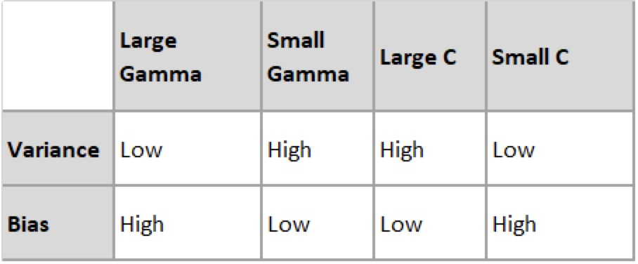
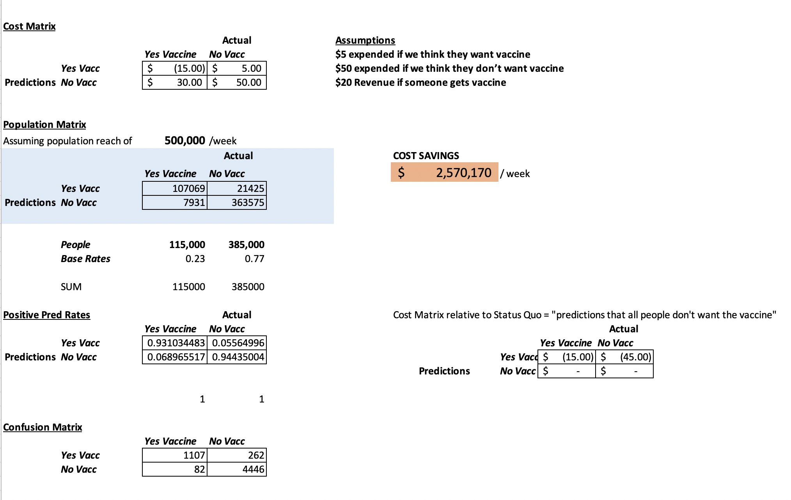

```{r setup, include=FALSE}
knitr::opts_chunk$set(echo = FALSE, warning=FALSE, message=FALSE, error=FALSE, cache = TRUE)
library(knitr)
library(dplyr)
library(ggplot2)
library(plyr)
library(mlbench)
library(GGally)
library(mltools)
library(data.table)
library(caret)
set.seed(03092000)
```

# Research Question and Hypotheses  
**Goal**: Through this project, our group hopes to utilize both the **Support Vector Machine** (SVM) and **Random Forest Classifier** models to predict whether a person is or is not going to get the H1N1 vaccine. These two algorithms were selected for the reasons that are provided below in the "Why Support Vector Machine and Random Forest Classifier" section. 

We will first begin by explaining some background information on the H1N1 virus, the dataset, and the two machine learning algorithms. From there, we will proceed with the model creation and the parameter tuning. Lastly, we will draw conclusions from our findings and discuss future applications. 

**General Question**: Will the SVM or the Random Forest Model Predict the Likelihood of a Person Getting the H1N1 Vaccine Better?

**Null Hypothesis**: The SVM Model will not outperform the Random Forest Classifier Model with regards to its F1 Score 
**Alternative Hypothesis**: The SVM Model will outperform the Random Forest Classifier Model with regards to its F1 Score

**Note**: The F1 score was the metric used to primarily evaluate the two models. To determine if the F1 scores are statistically significant, a **Wilcoxon Rank-Sum Test** will be utilized. More information about this can be found in the "Why F1 Score" section below.

# Why a Focus on F1 Score  


Throughout our project, we will be looking at multiple metrics to evaluate the performance of the SVM and Random Forest models. These include **accuracy, precision (specificity), and recall (sensitivity)**. While all of these metrics will play a role in how we tune the models' parameter and determine which model is more successful, to answer our question of which model outperforms the other we will be looking at the **F1 value**. 

**The F1 value is the harmonic mean of the sensitivity and specificity rates**, and it gives a better measure of the incorrectly classified cases than the accuracy metric would. It is scaled from 0 to 1, with 1 being the best. Because there is an imbalanced class distribution in our dataset, we will be analyzing the F1 score as it is a better indicator of which model is performing better. After getting the F1 scores for both the SVM and the Random Forest models, we will be utilizing a t-test to determine if the difference between the F1 scores of the models is due to chance or is statistically significant. This will determine whether a model outperforms the other.

An explanation of why the SVM and Random Forest models were specifically selected for this project will be explained later after some data cleaning. 

# Background on H1N1
The flu is an illness that is caused by the influenza virus, which can lead to various symptoms that include, but are not limited to, high fevers and sore throats. The Swine Flu, in particular, is a novel influenza A (H1N1) virus that emerged in Spring 2009. It is a subtype of the Influenza A Virus and is considered an **orthomyxovirus** that contains the glycoproteins **haemagglutinin** and **neuraminidase**. The Swine Flu was initially detected in the United States, eventually spreading to the rest of the world. It is said to have "contained a blend of flu genes that hadn't been previously seen in animals or people." The Swine Flu, although very similar to the Seasonal Flu, was found to be more contagious, and less people were found to have existing resistance. (Reference 2)


# About the Dataset  
The selected dataset for this project is originally from the National 2009 H1N1 Flu Survey but can also be found on [Driven Data](https://www.drivendata.org/competitions/66/flu-shot-learning/page/210/). 

Before building our machine learning algorithms, having a clear understanding of the data is critical. We must familiarize ourselves with the origin, size, key characteristics, behavior, and type of data. Our dataset is originally composed of **38 columns** and **26,707 observations**. Each observation accounts for one person who responded to the National 2009 H1N1 Flu Survey. There are five general groupings that each feature falls into. These data categories can be found below with a few examples of the types of variables that would belong to it: 

1. Presumptions
- h1n1_concern, h1n1_knowledge
2. Behavioral: public health measure and avoidance strategies
- behavioral_face_mask, behavioral_large_gatherings, behavioral_touch_face
3. Opinion: respondent’s opinion regarding the vaccine
- opinion_h1n1_risk, opinion_h1n1_sick_from_vacc
4. Demographics
- age_group, income_poverty, education, hhs_geo_region
5. Health Considerations: doctor recommendations, conditions
- doctor_recc_h1n1, chronic_med_condition, health_insurance

According to the CDC, initially there were **734,367 landline numbers** that were considered. After being narrowed down due to the unresponsiveness or the age of the respondent, a total of **105,499** respondents that were adults were found eligible. However, only **43.2%** of these individuals completed the interview. It is fair to assume that there is a **non-response bias** in play with the survey. This is important to keep in mind as it can be a source of explanation as to why the data may be imbalanced. It is very likely that individuals who were pro-vaccination were more likely to want to answer the National 2009 H1N1 Flu Survey, therefore, skewing the results. (Reference 1)

With responses from both the **adults and the children**, the CDC states that there are a total of **56,656** people who responded to the National 2009 H1N1 Flu Survey; these were composed of both landline and cellphone interviews. In our dataset, because we only have data for **26,707** respondents, it is safe to assume that the dataset is a sample of the original National 2009 H1N1 Flu Survey. (Reference 1)

Before getting into the details of why the SVM and Random Forest models were selected, we must clean the data and get a better understanding of it.

# Data Cleaning {.tabset}

## Reading in the Dataset
```{r, include=FALSE}
df_features <- read.csv("training_set_features.csv")
df_label <- read.csv("training_set_labels.csv")
df <- merge(df_features,df_label,by="respondent_id")
#head(df)
#sum(nrow(df))
```
The original dataset was provided in two csv files. To begin our analysis, we must first combine the two into one dataframe. This is because one csv file has the features we are interested in while the other has the labels for our observations (whether the individual received the H1N1 and Seasonal Flu Vaccine or not). We matched up each of the rows by the respondent_id, which was a column in both the features and the label csv files. 

## Removing the Seasonal Flu Columns
```{r}
df <- df[, -which(names(df) %in% c("doctor_recc_seasonal","opinion_seas_vacc_effective","opinion_seas_risk","opinion_seas_sick_from_vacc", "seasonal_vaccine"))]
head(df)
```
Given the recent COVID-19 pandemic, our group chose to focus only on the vaccination for H1N1, which is also known as the Swine Flu. We believe that our findings will be interesting in regards to comparing it to COVID-19. Therefore, we removed the five columns that only dealt with the Seasonal Flu.  

H1N1 was still seen as a “new virus”, although it was a different strain of the seasonal flu. Similarly, the COVID-19 virus and pandemic is also new and relatively unknown. We should be able to draw some similarities between skepticism and opinions regarding vaccinations between the two viruses.

## Looking at the Structure of the Data: Type and NA's
```{r}
str(df)
```
Looking at the structure of the dataset, we notice a few things. Initially, we notice that there are a few empty strings in some of the variables, for example employment_occupation and empoloyment_industry, that we want to convert to NA's. This will make it easier for us when we are analyzing the number of missing datapoints we have in order to figure out what variables we may want to consider dropping. Additionally, all of these variables must be converted to factors. This is because of the nature of the survey and types of variables we have present. 

We notice that for certain variables, specifically hhs_geo_region, employment_industry, and employment_occupation, these use a classification defined by the U.S. Dept. of Health and Human Services. Because these variables are encoded for confidentiality  purposes, and the encoding is not provided online, we are unable to make use these variables. Therefore, these columns will be dropped from the dataset.

## Changing the Empty Strings
```{r}
df <- replace(df, df == "", NA)
```
Here, we replaced all rows with empty strings to contain the value "NA" instead. This will come in handy as we proceed with the analysis.

## Looking at Na's and Removing Specific Columns
```{r}
colSums(is.na(df))
```
Looking at the number of NA's we have present in each column, we can see that the health_insurance, employment_industry, and employment_occupation make up the top 3 columns with the highest amount of NA's.

We decided to remove the health_insurance column for a few reasons. It was the main source of NA's within the dataset (12,274), and deleting rows associated with this column would have effectively eliminated nearly half of the dataset. In addition, we did some further research into the financial obligations regarding the H1N1 vaccine. According to the Centers for Disease Control (CDC), the government wanted to avoid any economic obstacles for everyday Americans when it came to obtaining a vaccine. Vaccination providers, such as clinics or drugstores, were not allowed to charge volunteers for the vaccine, as the supplies had already been purchased by the US Government. This allowed us to conclude that health insurance, therefore, would not be as necessary or as big of an obstacle for obtaining the H1N1 vaccine, in comparison to others. Further information can be found [here](https://www.cdc.gov/h1n1flu/vaccination/statelocal/vaccine_financing.htm).

We also chose to remove the employment_industry and employment_occupation variables. Similarly to health_insurance, removing observations with “NA” for these two variables would have resulted in nearly half of our dataset being eliminated. These variables include “codes” that are correlated to US Census data regarding industry and occupation types. Converting these to factor variables and then taking the average or median to engineer data for the NA's would be inaccurate. We would be left with very high numbers of one particular industry and occupation, which would not help the model in determining if people would get an H1N1 vaccine or not.

Lastly, we removed the respondent_id at this step. This variable was important when we were matching the features to the labels. However, for the machine learning algorithm, it is not needed.

```{r}
df <- df[, -which(names(df) %in% c("employment_occupation","health_insurance","employment_industry", "hhs_geo_region", "respondent_id"))]
df<- na.omit(df)
#write.csv(df,"df2.csv", row.names = TRUE) #saving to a new csv file
df2<- read.csv("df2.csv")  
nrow(df)
```
Here, along with removing the top 3 columns with the highest number of NA's, we also removed the hhs_geo_region variable for reasons mentioned above. We are left with 19,656 observations. Because this is still a significant portion of the original number of observations the dataset had (approximately 73.6%), we proceed with our analysis.

In this step of our project, we decided to save the current dataframe to a new csv file. This is because in the next step we will be coercing all of the features to factors; therefore, it is a good idea to keep a copy of the clean data that contains all of the features' data types as they originally were.

## Coercing the Variables to Factors
```{r}
df[,] <- lapply(df[,], factor)  ## as.factor() could also be used
str(df)
#write.csv(df,"cleaned_df.csv", row.names = TRUE) #saving to a new csv file
```
After this step, we can verify that all of the variables are now factors by using the str() function. Because they are all factors, we can carry on with our analysis.

# Why Support Vector Machine and Random Forest Classifier  
```{r, message = FALSE, warnings = FALSE}
library(ggplot2)

as.data.frame(count(df$h1n1_vaccine))
count.data <- data.frame(
  class = c("Vaccinated", "Not Vaccinated"),
  n = c(4517, 15139),
  prop = c(23, 77)
)

mycols <- c("#e998ac","#01cfcc")
# Add label position
count.data <- count.data %>%
  arrange(desc(class)) %>%
  mutate(lab.ypos = cumsum(prop) - 0.5*prop)
count.data

x<- ggplot(count.data, aes(x = 2, y = prop, fill = class)) +
  geom_bar(stat = "identity", color = "white") +
  coord_polar(theta = "y", start = 0)+
  geom_text(aes(y = lab.ypos, label = prop), color = "white")+
  scale_fill_manual(values = mycols) +
  theme_void()+
  xlim(0.5, 2.5)

#ggsave("test.png", bg = "transparent")
x
```

After a preliminary analysis of the data topology, our group decided to compare the SVM and Random Forest models. We were curious to how these two models would perform against one another due to the nature of the algorithms. Both are **supervised machine learning algorithms** which can be used for **classification** or **regression** analysis. For the purposes of our analysis, we will be using these algorithms to classify which group a person, given various features, is likely to belong to (vaccine/no vaccine). We selected these algorithms because they are both great for imbalanced datasets, which as we can see above, our dataset has a base rate of 23% for the group who received the vaccine; because our dataset is imbalanced, it is critical to utilize algorithms that can deal with it fairly well. Similarly, both of the algorithms reduce the risk of over-fitting in their own manner. This is also extremely important for our model as overfitting to the dataset can falsely skew the accuracy of the model.

In theory, the Random Forest model would have a few benefits over the SVM model. The Random Forest is non-parametric, so outliers would not be an issue for the algorithm. Similarly, they are extremely easy to build (compared to SVMs) and are fast/scalable. Unlike with SVMs, Random Forests do not require a lot of parameter tuning. These are all characteristics of the algorithm that make it extremely favorable for this research study.

However, the SVM model also has a few general benefits over the Random Forest model. Usually, the SVM model is known to be highly efficient and accurate. Similarly, the SVM model scales well to high dimensional data, which is not significantly relevant for our dataset as we have more observations than we do features. However, the main reason why we predict that the SVM model will outperform the Random Forest model is because of the kernels that the SVM model uses. With an appropriate kernel and degree of the kernel, we can expect the algorithm to work extremely well even if the data is not linearly separable in the base feature space, which in this instance applies to our dataset.

In order to begin building our model, we now proceed to the EDA, followed by the feature selection. These are two sections that will help us gain a better understanding of the dataset and re-adjust our hypotheses, if needed. 

# EDA {.tabset}

In order to continue with the project, we first wanted to explore the data and to try to get an idea of the types of people within the dataset that may choose to get the vaccine. For this, we decided to create histograms depicting different features from each of the categories we had: presumptions, behavioral, opinion, demographic, and health considerations. In our EDA, we will mainly be exploring the question of "Who is being represented in the data?" We will then be looking at the various categories to understand the following:

- Presumptions: How concerned and how much knowledge do respondents have regarding the H1N1 virus?

- Behavioral: How have respondents behavior changed in response to the H1N1 virus?

- Opinion: What opinions do the respondents hold regarding H1N1 risk and the vaccine?

- Demographics: What are the demographics of the respondents?

- Health: What health considerations did the respondents report?

## Histogram for "Presumptions" Variables
```{r}
pre_1 <- ggplot(df2, aes(x=h1n1_concern)) +
  geom_histogram(stat="count",bins=4,fill="#015977",color="black")+xlab("Level of H1N1 Concern") + geom_text(aes( label = scales::percent(..prop..),y= ..prop.. ), stat= "count", vjust = -.5)
pre_1
```

Over 70 percent of respondents presented a moderate level of concern regarding H1N1. 11.5% and 16.2% indicated "not at all concerned" and "very concerned", respectively. We would expect those that indicated "very concerned" to be the most likely to get the H1N1 vaccine.

0-Not at all concerned  
1-Not very concerned  
2-Somewhat concerned  
3-Very concerned  

```{r}
pre_2 <- ggplot(df2, aes(x=h1n1_knowledge)) + 
  geom_histogram(stat="count",bins=3,fill="#015977",color="black")+xlab("Level of H1N1 Knowledge") + geom_text(aes( label = scales::percent(..prop..),y= ..prop.. ), stat= "count", vjust = -.5)
pre_2
```

The histogram shows there to be a suprisingly large proportion of respondents that indicated "A lot of knowledge" of the H1N1 Virus, with 37%. Only 7% indicated "No knowledge". We would expect the majority of those that reported having "A lot of knowledge" to want the vaccine, when compared to those reporting "No knowledge".

0-No knowledge  
1-A little knowledge  
2-A lot of knowledge  

## Histogram for "Behavioral" Variables
```{r}
beh1 <- ggplot(df2, aes(x=behavioral_wash_hands)) + 
  geom_histogram(stat="count",bins=2,fill="#35648F",color="black")+xlab("Frequent Hand Washing / Hand Sanitizer Use") + geom_text(aes( label = scales::percent(..prop..),y= ..prop.. ), stat= "count", vjust = -.5)
beh1
```

17% of respondents indicated infrequent hand washing and lack of sanitizer use, while 83% indicated the opposite. We would expect those that reported frequent usage to be more likely to get the H1N1 vaccine, as this indicates more self-awareness of healthy habits and the presence of germs.

0-No  
1-Yes  

```{r}
beh2 <- ggplot(df2, aes(x=behavioral_large_gatherings)) + 
  geom_histogram(stat="count",bins=2,fill="#35648F",color="black")+xlab("Avoidance of Large Gatherings") + geom_text(aes( label = scales::percent(..prop..),y= ..prop.. ), stat= "count", vjust = -.5)
beh2
```

65% of respondents indicated NOT avoiding large gatherings during the H1N1 crisis, while 35% indicated the opposite. We would expect those that indicated that they practiced avoidance measures to be more likely to get the H1N1 vaccine, as they would seem to be more worried of the risks of the virus.

0-No  
1-Yes  

## Histogram for "Opinion" Variables
```{r}
opi1 <- ggplot(df2, aes(x=opinion_h1n1_risk)) + 
  geom_histogram(stat="count",bins=5,fill="#606DA2",color="black")+xlab("Opinion of H1N1 Risk") + geom_text(aes( label = scales::percent(..prop..),y= ..prop.. ), stat= "count", vjust = -.5)
opi1
```

There is a relatively large disparity between opinions regarding H1N1 risk. Nearly 70% of respondents indicated the risk to be "Very Low" or "Somewhat Low", while only 28.2% indicated the risk posed by H1N1 to be "Somewhat High" or "Very High".  

1-Very Low  
2-Somewhat Low  
3-Don't Know  
4-Somewhat High  
5-Very High  

```{r}
opi2 <- ggplot(df2, aes(x=opinion_h1n1_sick_from_vacc)) + 
  geom_histogram(stat="count",bins=5,fill="#606DA2",color="black")+xlab("Opinion of Sickness from H1N1 Vaccine") + geom_text(aes( label = scales::percent(..prop..),y= ..prop.. ), stat= "count", vjust = -.5)
opi2
```

There is a relatively large disparity between opinions regarding getting sick from the H1N1 vaccince. 69.5% of respondents indicated the risk of sickness to be "Not at all worried" or "Somewhat Worried", while only 30.2% indicated the risk of sickness to be "Somewhat Worried" or "Very Worried".

1-Not at all worried  
2-Not very worried    
3-Don't know  
4-Somewhat worried  
5-Very worried  

## Histogram for "Demographics" Variables
```{r}
dem1 <- ggplot(df2, aes(x=age_group)) + 
  geom_histogram(stat="count",fill="#8C74AE",color="black")+xlab("Age Group")
dem1
```

The 65+ age group was the most represented among respondents, while the 35-44 was the least represented.


```{r}
dem2 <- ggplot(df2, aes(x=education)) + 
  geom_histogram(stat="count",fill="#8C74AE",color="black")+xlab("Level of Education")
dem2
```

The majority of respondents indicated having at least some college. The most represented group were College Graduates.


```{r}
dem3 <- ggplot(df2, aes(x=employment_status)) + 
  geom_histogram(stat="count",fill="#8C74AE",color="black")+xlab("Employment Status")
dem3
```

Over 50% of respondents indicated that they were employed.


## Histogram for "Health Considerations" Variables
```{r}
hc1 <- ggplot(df2, aes(x=doctor_recc_h1n1)) + 
  geom_histogram(stat="count",bins=2,fill="#B77AB0",color="black")+xlab("Doctor Recommendation of H1N1 Vaccine") + geom_text(aes( label = scales::percent(..prop..),y= ..prop.. ), stat= "count", vjust = -.5)
hc1
```

77% of respondents indicated that their doctor did NOT recommend getting the H1N1 Vaccine, while only 23% indicated the presence of a recommendation.

0-No  
1-Yes  

```{r}
hc2 <- ggplot(df2, aes(x=chronic_med_condition)) + 
  geom_histogram(stat="count",bins=2,fill="#B77AB0",color="black")+xlab("Chronic Medical Condition") + geom_text(aes( label = scales::percent(..prop..),y= ..prop.. ), stat= "count", vjust = -.5)
hc2
```

72% or respondents indicated NOT having a chronic medical condition, while 28% indicated the presence of a chronic medical condition.
0-No  
1-Yes  

# Feature Selection {.tabset}

## LASSO Regression Model 

### Why LASSO Regression

Initially, we want to utilize lasso regression to reduce the feature space. LASSO regression is an analysis method that utilizes both variable selection and regularization to further enhance the predictive accuracy and interpretability. It imposes a constraint on the model parameters that causes the regression coefficients for some of the variables to shrink towards zero.

```{r}
set.seed(03092000)
library(mltools)
library(data.table)

# Split the data into training and test set
training.samples <- df$h1n1_vaccine %>% 
  createDataPartition(p = 0.8, list = FALSE)
train.data  <- df[training.samples, ]
test.data <- df[-training.samples, ]

#newdata <- one_hot(as.data.table(df))

# Dummy code categorical predictor variables
x <- model.matrix(h1n1_vaccine~., train.data)[,]
# Convert the outcome (class) to a numerical variable
y <- ifelse(train.data$h1n1_vaccine == 1, 1, 0)
```

### Computing Penalized Logistic Regression
```{r}
set.seed(03092000)
library(glmnet)

#Computing the Penalized Logistic Regression
LASSO_Reg <-glmnet(x, y, family = "binomial", alpha = 1) 

#Fit the final model on the training data
model <- glmnet(x, y, alpha = 1, family = "binomial",
                lambda =  LASSO_Reg$lambda.min)

# Make predictions on the test data
x.test <- model.matrix(h1n1_vaccine ~., test.data)[,]
probabilities <- model %>% predict(newx = x.test)
predicted.classes <- ifelse(probabilities > 0.5, "pos", "neg")

coef(LASSO_Reg)  #display regression coefficients
plot(LASSO_Reg) #each lines a feature, the ones retained are the ones on the top 
```


```{r}
#getting the actual coefficient for lambda 
coeffs <- coef(LASSO_Reg, s = 0.1) 
coeffs.df <- data.frame(name = coeffs@Dimnames[[1]][coeffs@i + 1], coefficient = coeffs@x) 

# reordering the variables in term of coefficients
coeffs.df[order(coeffs.df$coefficient, decreasing = T),]

#cross-validation done by cv.glmnet
cv.fit <- cv.glmnet(x, y)
cv.fit

plot(cv.fit)

#1SE furthest to the right for lambda 
cv.fit$lambda.min

#Optimized run of the model 
optimal_reg <-glmnet(x, y, family = "binomial", alpha = 0.006919) 
plot(optimal_reg) #look back at the coefficients 
coef(optimal_reg)
```


```{r}
# create a function to transform coefficient of glmnet and cvglmnet to data.frame
coeff2dt <- function(fitobject, s) {
  coeffs <- coef(fitobject, s) 
  coeffs.dt <- data.frame(name = coeffs@Dimnames[[1]][coeffs@i + 1], coefficient = coeffs@x) 

  # reorder the variables in term of coefficients
  return(coeffs.dt[order(coeffs.dt$coefficient, decreasing = T),])
}

coeff2dt(fitobject = cv.fit, s = "lambda.min") %>% head(30)

#threshold - block method (prop.) 
```

### Creating a Lasso Coefficient Plot
```{r}
coeffs.table <- coeff2dt(fitobject = cv.fit, s = "lambda.min")
ggplot(data = coeffs.table) +
  geom_col(aes(x = name, y = coefficient, fill = {coefficient > 0})) +
  xlab(label = "") +
  ggtitle(expression(paste("Lasso Coefficients with ", lambda, " = 0.006919"))) +
  theme(axis.text.x = element_text(angle = 45, hjust = 1),
        legend.position = "none") 
```

### Isolate Variables of Interest 
```{r}
varOfInterestPos = coeff2dt(fitobject = cv.fit, s = "lambda.min") %>% filter(coefficient >= 0.03)
varOfInterestNeg = coeff2dt(fitobject = cv.fit, s = "lambda.min") %>% filter(coefficient <= -0.03)
varOfInterest = c( varOfInterestPos[,1], varOfInterestNeg[,1])
varOfInterestFinal = varOfInterest[varOfInterest != "(Intercept)"]
varOfInterestFinal

varsOfInt = c('opinion_h1n1_risk', 'opinion_h1n1_vacc_effective', 'child_under_6_months', 'education', 'opinion_h1n1_sick_from_vacc', 'race', 'age_group', 'health_worker', 'doctor_recc_h1n1', 'h1n1_concern')

kable(varsOfInt, col.names = "Most Contributing Variables")
```
As can be seen above, there are 10 distinct variables that we plan to utilize within our SVM model. In this model, we chose to remove all of the variables that had coefficients that had an absolute value of 0.03 or less (were non-contributing). We removed variables that did not have a single level appear within our coefficient plot. Conversely, we kept a variable if there was at least one level that exceeded the 0.03 (absolutle value) coefficient threshold that we set. This significant reduction of the feature space promotes sparsity and makes the model *"mean and lean"*. 


# One-Hot Encoding 
```{r}
library(mltools)
library(Matrix)

df_varOfInt = df %>% 
  select( varsOfInt, h1n1_vaccine)

df_onehot = as.data.frame(as.matrix(sparse.model.matrix(~. -1, data = df_varOfInt)))


```

```{r}

names(df_onehot)[30] <- "h1n1_vaccine"

kable( head((df_onehot)[,1:4]) )

```
We then proceeded one-hot encode the dataset, and reduced the feature space to only contain the 10 most important distint variables previously described.


# High-Level Modeling Approach 

Utilizing both the polynomial kernel and the radial kernel, we will explore tuning the hyperparameters and comparing the performance of each as they both possessed similar RMSE values. We initially ran multiple kernels and selected the Polynomial Kernel due to its low RMSE of 0.401, with the Radial Kernel following close behind at an RSME of 0.417. However, because these kernel’s performed very similarly with regard to our loss function, we would still like to further assess both kernels.

Following the execution of the SVM, we would like to proceed with the Random Forest and aim to tune the hyperparameters for optimal performance. Having tuned both of the models, we will run the optimal SVM and Random Forest 10 times each. Then, the statistical significance of the resulting F1 Scores of each algorithm will be assessed for statistical significance with a Wilcoxon-Rank Sum Test. 


# Data Partitioning
```{r}
# Creating the Training, Testing, and Validation Sets

combined_df <- cbind(df,df_onehot) #28 col in df, 30 col in df_onehot 

# Creating the random training, validation, and testing sets
data_train <- sample(1:nrow(df),
               round(0.7 * nrow(df), 0), 
               replace = FALSE)

data_test <- sample(1:nrow(df),
               round(0.3 * nrow(df), 0), 
               replace = FALSE)

#Assigning random selection to original df
original_train <- combined_df[data_train, 1:28] #Should contain 70% of data points
original_test <- combined_df[data_test, 1:28 ]

#Assigning random selection to one hot encoded df 
onehot_train <- combined_df[data_train, 29:58] #Should contain 70% of data points
onehot_test <- combined_df[data_test, 29:58]


```

We chose a 70/30 split for our analysis, due to a variety of beneficial factors. 70% training data allows for ample examples for our model to find the most accurate solutions during the testing phase. 70% allocates enough “practice” data, while still leaving ample data for use later. In addition, 30% of test data, in our opinion, is the perfect sweet spot to test our model to unseen data.

# SVM Model {.tabset}


## Polynomial Kernel 
```{r}
#install.packages('e1071') 
library(e1071) 
set.seed(03092000)
classifier_original <- svm(formula = h1n1_vaccine ~ ., 
                 data = original_train, 
                 type = 'C-classification',  #Default
                 #can change degree 
                 kernel = 'polynomial')  #The kernel used in training and predicting

```

```{r}
# Predicting the test set results 

y_pred_original <- predict(classifier_original, newdata = original_test[-28]) 
```

### Confusion Matrix Results
```{r}
# Making a Confusion Matrix 
#install.packages("caret")
library(caret)
cm_original_poly <- confusionMatrix(original_test$h1n1_vaccine,y_pred_original, positive = "1")
cm_original_poly
```
The accuracy and sensitivity were good relative to the basis, at 0.78 and 0.81 respectively. Something to note here is that the model overwhelmingly predicted the negative class, at a rate of 0.99448. This will be certainly be reflected in the F1 Score. 

```{r}
f1score_poly = 2*0.83766  *(129/(129+1235))/(0.83766   + (129/(1235+129)) )
f1score_poly
```
Our primary metric, the F1 Score, was calculated to be 0.1699 - this is awful. Let's try it with the radial kernel. 


## Radial Kernel 

```{r}
#install.packages('e1071') 
library(e1071) 
set.seed(03092000)
classifier_original2 <- svm(formula = h1n1_vaccine ~ ., 
                 data = original_train, 
                 type = 'C-classification',  #Default
                 #can change degree 
                 kernel = 'radial')  #The kernel used in training and predicting

```


```{r}
# Predicting the test set results 

y_pred_original2 <- predict(classifier_original2, newdata = original_test[-28]) 
```

### Confusion Matrix Results
```{r}
# Making a Confusion Matrix 
#install.packages("caret")
library(caret)
cm_original_radial <- confusionMatrix(original_test$h1n1_vaccine,y_pred_original2, positive = "1")
cm_original_radial
```
The overall accuracy improved some to 0.8303, while the false positive rate decreased from 0.2216 to 0.15333.


```{r}
f1score_radial = 2*0.72716*(507/(780+509))/(0.72716 + (589/(780+589)) )
f1score_radial
```


However, our main metric, the *F1 Score*, is *0.4942*. This is a significant improvement from the the polynomial kernel!
Let's try with the reduced features!

## Radial Kernel with Feature Reduction


```{r}
#install.packages('e1071') 
library(e1071) 
set.seed(03092000)

classifier_onehot <- svm(formula = h1n1_vaccine ~ ., 
                 data = onehot_train, 
                 type = 'C-classification',  #Default
                 #can change degree 
                 kernel = 'radial')  #The kernel used in training and predicting

```

```{r}
# Predicting the test set results 
#head(df)
y_pred_onehot <- predict(classifier_onehot, newdata = onehot_test[-30]) 
```


### Confusion Matrix Results
```{r}
# Making a Confusion Matrix 
#install.packages("caret")
library(caret)
cm_onehot_radial <- confusionMatrix(as.factor(onehot_test$h1n1_vaccine),y_pred_onehot, positive = "1")
cm_onehot_radial
```


Notably there are improvements in accuracy and sensitivity. The accuracy improved very slightly to 0.8375 while sensitivity increased slgihtly and the false positive rate decreased slightly (~.01)

```{r}
f1score_radial_onehot = 2* 0.7302 *(644/(644+720))/( 0.7302  + (644/(644+720)) )
f1score_radial_onehot

```


With regard to our key metric, the *F1 Score* remained slgihtly increased from *0.4942* to *0.5734*. While much of the improvments may seem minute and trivial, the slight improvement of the model on the feature selected model is excellent news. As the model will be much less computationally expensive on the reduced feature space. This gives us hope that our new model will be a greater asset, as it is both leaner and meaner. 

Now, we will approach the SVM hyperparameter tuning. 

## Hyperparameter Tuning Proccess 

```{r}

library(e1071)
set.seed(03092000)

obj <- tune(svm, h1n1_vaccine~., data = onehot_test, 
            ranges = list(gamma = 2^(-1:1), 
                          cost = 2^(2:4)),
            tunecontrol = tune.control(sampling = "fix"))
summary(obj)

```

The indicated optimal performance hyperparameters are gamma = 0.5 and cost = 8. 

Something that we want to consider while the tuning cost and gamma is bias-variance tradeoff. 



As shown above, larger cost and smaller gamma values result in high levels of variance and low levels of bias. This means that the model will be more receptive towards new, unseen data and does not care as much about fitting more to the data at hand. At the same time smaller cost and larger gamma values result in low variance and high bias. For our purposes, the optimized selection of C = 8 and Gamma = 0.5 leaves us with a small C and small gamma, balancing out the model in terms of the bias-variance tradeoff exhibited.


```{r}

plot(obj)
```


#As can be seen above, the optimal gamma is a gamma of 0.5 and a cost was 8.


## Radial Kernel with Feature Reduction & Tuning 
```{r}
#install.packages('e1071') 
library(e1071) 

set.seed(03092000)
classifier_onehot_tuned <- svm(formula = h1n1_vaccine ~ ., 
                 data = onehot_train, 
                 type = 'C-classification',  #Default
                 #can change degree 
                 kernel = 'radial',
                 cost = 16,
                 gamma = 0.5)  #The kernel used in training and predicting

```

```{r}
# Predicting the test set results 

y_pred_onehot_tuned <- predict(classifier_onehot_tuned, newdata = onehot_test[-30]) 
```

### Confusion Matrix Results
```{r}
# Making a Confusion Matrix 
#install.packages("caret")
library(caret)
cm_onehot_radial_tuned <- confusionMatrix(as.factor(onehot_test$h1n1_vaccine),y_pred_onehot_tuned, positive = "1")
cm_onehot_radial_tuned
```


```{r}
f1score_radial_onehot = 2*0.8782 *(728/(636+728))/(0.8782  + (728/(636+728)) )

f1score_radial_onehot
```
The F1 Score improved to achieve an score of 0.664! In addition, the kappa value (useful in scenarios like ours with unbalanced data), also improved to 0.5927, up from the pre-tuned model which had a Kappa value of 0.4788.


# Summary of SVM Results 
```{r}

Model = c("Polynomial", "Radial", "Radial", "Tuned Radial")
Dataset = c("Original", "Original", "Feature Reduced", "Feature Reduced")
F1Score = c(0.1699, 0.4942, 0.5724, 0.6639)
Kappa = c(0.1221, 0.4448, 0.4788, 0.5927)
Specificity = c(0.7832, 0.8467, 0.8564, 0.8745)
Sensitivity = c(0.8376, 0.7271, 0.7302, 0.8782)
Accuracy = c(0.784, 0.8303, 0.8375, 0.875)

svm_results = data.frame( Model, Dataset, F1Score, Kappa, Specificity, Sensitivity, Accuracy)

kable(svm_results)


```
As shown above, the models all performed generally better across the board as we continued to test. Relating to our primary metric F1 Score, our optimal F1 score was 0.6639, significantly increasing from the first model to the optimized final model. In addition, another metric we were observing due to the imbalanced nature of our data was the kappa value, which also drastically increased from the base model to the final model. Now, we will examine the Random Forest Model.


# Summary of Random Forest Model Results 
```{r}

Model_RF = c("Random Forest", "Tuned", "Random Forest", "Tuned Random Forest")
Dataset_RF = c("Original", "Original", "Feature Reduced", "Feature Reduced")
F1Score_RF = c(0.8670, 0.8655, 0.6646, 0.6649)
Kappa_RF = c(0.8303,0.8285, 0.5860, 0.5862)
Specificity_RF = c(0.9453, 0.9444, 0.8790, 0.8791)
Sensitivity_RF = c(0.9298, 0.9310, 0.8122, 0.8116)
Accuracy_RF = c(0.9422, 0.9417, 0.8682, 0.8682)

RF_results = data.frame( Model_RF, Dataset_RF, F1Score_RF, Kappa_RF, Specificity_RF, Sensitivity_RF, Accuracy_RF)

kable(RF_results)

```
The Aggregated Random Forest Model Results are shown above. The best performing model in terms of F1 Score was the original random forest created on the full dataset. We want to select the tuned random forest for further exploration and use, due to the decrased computing burden necessary. This is because the tuned model utilized 188 trees, as opposed to the 200 trees utilized in the original random forest model, which only performed slightly better (F1 Score 0.0015 better). The tuned random forest, utilizing the original data, had an F1 Score of 0.8655. Noticeably, the feature reduced models performed relatively poorly. Tuning the feature reduced random forest had little to no effect across the board. 


# Optimized SVM and Random Forest Model Sampling 

```{r}

`Model Type` = c("SVM F1 Scores", "Random Forest F1 Scores")

svm_f1 = c(0.6768,	0.6746,	0.6672,	0.6771,	0.6780,	0.6893,	0.6683,	0.6724,	0.6712,	0.6764)
rf_f1 =  c(0.8655,	0.8725,	0.8677,	0.8686,	0.8671,	0.8658,	0.8659,	0.8680,	0.8686,	0.8697)

Comp_results = data.frame( svm_f1, rf_f1)

kable(Comp_results,  col.names = `Model Type`)
```
The optimal SVM and Random Forest Models identified earlier were run ten different times, having removed the seed. These results will now be fed into the Wilcoxon Rank-Sum Test for significance.

#Wilcoxon Rank-Sum Test

We decided not to do a T-Test as originally planned, as we realized that we needed to have a *non-parametric test*. The Wilcoxon Rank Sum Test is best for this, as it acts as a non-parametric version of the Two-Sample T-Test. The test does not assume that the data has a known distribution, which works for our data as we would only be dealing with 10 data points each. Working well with a small sample size is another benefit of the Wilcoxon Rank-Sum Test, which is another reason we chose it. In addition, our program wouldn’t have ran more than 10 as a sample size, as we had space constraints.

Results - After conducting the Wilcoxon Rank-Sum Test for the Tuned Radial SVM and Tuned Random Forest models, we noted some important results. Our statistical testing included a Z-value of -2.8031 and a *P-value of .00512*. Testing at a significance level of 0.05, this allowed us to confirm the rejection of our Null Hypothesis. 

*The SVM Polynomial Kernel will not perform differently than the Random Forest Classifier Model with regards to its F1 Score.*


# Value and Future Work 

## Future Analysis
This study primarily focused on developing the best classification model to predict whether a person would receive the H1N1 vaccination or not. However, there are multiple directions that future analysis could go. Below, our group has highlighted the top three future analysis studies we believe would be the strongest and most interesting.

1. This research project focused on specifically the H1N1 (or Swine) Flu epidemic. For future analysis, completing a similar analysis on data collected from other pandemics and epidemics could be critical. A similar analysis could be especially useful when conducting a model build with similar data points and types (such as binary or factor), as well as with similar imbalances in the data. By building models and exploring the topology of the datasets, the data scientist may be able to gain some insight as to what factors make a person more likely to get vaccinated during, or after, a pandemic. They could also use the data to try to predict if a person would get vaccinated in the event of a future pandemic. This is especially important to understand given the current state of the world in regards to the COVID-19 pandemic. It is imperative to note, however, that the COVID-19 pandemic may be somewhat of an “outlier” case. Issues and ideas regarding the vaccine, and even the virus in general, have been hyper-politicized. While the data we examined does not factor into effect political affiliation, that variable would be an important aspect when conducting an analysis on COVID-19. In the future as new viruses emerge, having a clear understanding of the factors that contribute to an individual getting a vaccination will become increasingly important.

More information regarding the hyper-politicization of the COVID-19 pandemic and vaccine can be found [here](https://www.washingtonpost.com/politics/2020/12/22/how-political-leaders-could-persuade-more-americans-get-covid-19-vaccination/).

2. Another approach to a future analysis comes in the form of including the seasonal_vaccine variable, and the other seasonal-specific variables that we originally eliminated from our analysis. We originally didn’t include the seasonal data, as to focus on just H1N1 and how we could predict vaccinations from a “new virus” standpoint. By taking an alternative approach by including both seasonal and H1N1 data, we could examine and model trends between the two vaccines - such as specific demographics that showed opposing views between both vaccines, opinions regarding risks associated between the two viruses/vaccines, etc. This could help give us a better idea as to how people react differently when presented with an unusual and abnormal epidemic, in comparison to the yearly virus that they are all used to. We could also take the data from this different approach and use it as inference into how people may view the COVID-19 pandemic and vaccine. In addition, these varying data and trends between the seasonal and H1N1 data could give health officials ideas in regards to running vaccination campaigns. The data would give us insight into certain groups of people who may see their risk from seasonal to the H1N1 flu to be lesser, and could target these groups for public health and vaccination resources to increase vaccination rates and boost public opinion and knowledge.

3. Lastly, another approach could give us incredible insight regarding some of the variables that we were unable to decode. We were unable to decode the anonymous-code-ids from the hhs_geo_region, employment_industry, and employment_occupation features. In a perfect world, we would have the information regarding how to decode these ids and could use the information in an analysis. These data may be beneficial in building a model that more accurately predicts if someone would get the vaccine, or not. For example, geographical region could have a lot to do with a person’s views on the vaccine - whether that be political, access to health resources, number of virus cases in the area, etc. Occupation and employment industry information may also be important, as some workers in certain sectors may feel that they are at more risk to the virus than others, thus wanting the vaccine.

## Value - Potential Use Case:

A Government-based Targeted Marketing Campaign to Encourage Individuals to get Vaccinated.

To utilize potential opportunities from our model results, we decided to create an idea of how the government could save money using the results of our model to target specific individuals in marketing campaigns for the vaccine. 

*Our assumptions are as follows*: 
    - Outreach of 500,000 people each week
    - Average revenue from the H1N1 vaccine of $20
    - Expenditure of $50 in marketing to convince those we predict to not want the vaccine
    - Expenditure of $5 in marketing of vaccine-related resources to those we predict to want the vaccine
    - The population sampled in the original data survey was reflective of the US population.

Using the the optimal Tuned Random Forest Model, we utilized its confusion matrix, alongside a population matrix and a cost matrix to calculate the cost savings relative to the status quo (no model). 



According to our Random Forest Model and the marketing assumptions, the government would save an estimated $2,570,170 each week through targeted marketing campaigns.


# References
1. <ftp://ftp.cdc.gov/pub/Health_Statistics/NCHS/Dataset_Documentation/NIS/nhfs/nhfspuf_DUG.PDF>
2. <https://www.cdc.gov/h1n1flu/surveillanceqa.htm>
3. <https://towardsdatascience.com/simplifying-precision-recall-and-other-evaluation-metrics-d066b527c6bb>
